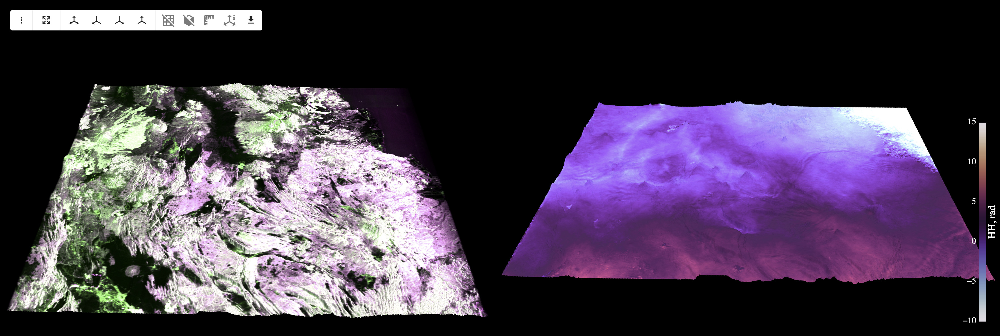
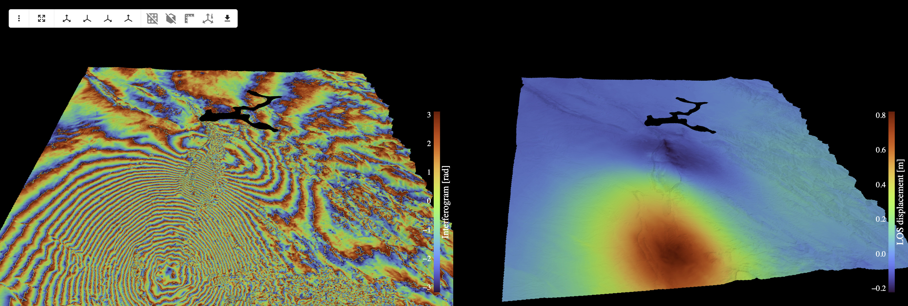
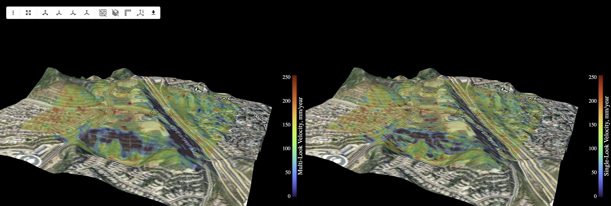

## InSAR.dev—Python Ecosystem for Interferometric Synthetic Aperture Radar

InSAR.dev is under active development—new features (and occasionally bugs) are added frequently. Please pin your library versions to ensure reproducibility. When something changes, check the published live examples, which are updated alongside library changes.

The previous-generation [PyGMTSAR](https://github.com/AlexeyPechnikov/pygmtsar) library is production-ready but requires GMTSAR binaries, supports only Sentinel-1, and has fewer processing capabilities.

## Components

| Package | Description | License |
|---------|-------------|---------|
| [insardev](./insardev/) | Core interferometric processing and analysis | InSARdev-SAL-1.0 |
| [insardev_pygmtsar](./insardev_pygmtsar/) | Sentinel-1 and NISAR SLC preprocessing | BSD 3-Clause |
| [insardev_toolkit](./insardev_toolkit/) | Utility functions and helper tools | BSD 3-Clause |

## Features

- **Per-burst/swath processing** — each Sentinel-1 TOPS burst and NISAR swaths processed independently on a geocoded grid, no frame stitching required
- **Geometric and xcorr coregistration** — bursts and swaths aligned to a reference via radar-to-geographic transforms and refined by xcorr with differential topo phase correction between reference and repeat geometries
- **Cloud-native storage** — Zarr v3 with chunked arrays, works with local disk or GCS/S3 via fsspec
- **GPU-accelerated** — interferogram generation, filtering, detrending, phase unwrapping (1D and 2D) on Apple MPS and NVIDIA CUDA
- **Time series analysis** — SBAS and PSI with least-squares and STL decomposition
- **Dual-polarization support** — all polarization channels (VV+VH or HH+HV) processed separately or together for PolSAR analysis
- **Ascending and descending on the same grid** — both orbit directions processed in common geocoded coordinates for straightforward vertical and east-west displacement decomposition
- **Per-pixel incidence geometry** — elevation-corrected incidence from spherical Earth model, no central-point approximation
- **Integrated data access** — download Sentinel-1 bursts and NISAR polarizations and frequencies, Sentinel-1 orbits, DEM, land mask, and map tiles
- **Runs anywhere** — locally on MacOS/Linux/Windows, on Google Colab, GitHub runners, Docker containers, and even Raspberry Pi 4 & 5

## Interactive Examples on Google Colab

All examples are tested to work even on FREE Google Colab instances (2 slow vCPU, 12GB RAM, very slow disk access). For faster processing, preprocess Sentinel-1 or NISAR data at lower resolution and store and reuse preprocessed Zarr stacks to complete InSAR analysis in just 10–15 minutes. You can easily share your results publicly or with selected users, and everyone can reproduce your results fast and for free. That's ideal for educators and students.

For a $10/month Google Colab subscription, you get approximately 60 hours of L4 GPU instances—enough to run the NISAR processing example at full resolution 100–300 times (depending on NASA ASF portal download speed) with the full pipeline including SLC data downloading and preprocessing, or more than 500 times using preprocessed Zarr datasets stored on Zenodo, GitHub, etc. Often, complete PolSAR and InSAR analysis can be done in a few minutes. For NISAR, use frequency B to reduce download size and processing time; if better resolution is needed, just rerun the same pipeline with frequency A.

 NISAR L-Band HH/HV RGB composite, HH interferogram, and unwrapped phase.

 **Iran–Iraq Earthquake (2017)**. The results compared to outputs from GMTSAR, SNAP, and GAMMA software. Illustrates bursts search by area, date, and attributes.

 **Central Türkiye Earthquakes (2023).** Interferogram covering two consecutive Sentinel-1 scenes (56 bursts).

 **Imperial Valley Subsidence, CA USA (2015).** SBAS velocity map from a Sentinel-1 time series stack. Interactive result: [Imperial_Valley_2015.html](https://insar.dev/ui/Imperial_Valley_2015_ipyleaflet.html). Uses the same bursts as the GMTSAR ['Sentinel-1 TOPS Time Series' example](http://topex.ucsd.edu/gmtsar/tar/S1A_Stack_CPGF_T173.tar.gz).

 **Golden Valley Subsidence, CA USA (2021).** SBAS velocity map detecting subsidence exceeding 5 cm/year near Antelope Valley Freeway in Santa Clarita, CA. Reproduces results from the EarthDaily [Sentinel-1 Technical Series](https://earthdaily.com/blog/sentinel-1-targeted-analysis).

 **Erzincan Elevation, Türkiye (2019).** DEM generation from a single Sentinel-1 interferometric pair. Reproduces the ESA tutorial [DEM generation with Sentinel-1 IW](https://step.esa.int/docs/tutorials/S1TBX%20DEM%20generation%20with%20Sentinel-1%20IW%20Tutorial.pdf).

## License

This repository contains components with different licenses:

- **insardev/** - InSAR.dev Source-Available License (see [insardev/LICENSE](./insardev/LICENSE))
- **insardev_pygmtsar/** - BSD 3-Clause License (see [insardev_pygmtsar/LICENSE](./insardev_pygmtsar/LICENSE))
- **insardev_toolkit/** - BSD 3-Clause License (see [insardev_toolkit/LICENSE](./insardev_toolkit/LICENSE))

For funded academic, institutional, or professional use of the insardev package, see [insardev/SUBSCRIBE](./insardev/SUBSCRIBE).

## Contact

- Author: Aleksei (Alexey) Pechnikov
- Email: alexey@pechnikov.dev
- ORCID: https://orcid.org/0000-0001-9626-8615

## Bug Reports

Bug reports and suggestions are welcome via the project's issue tracker.
